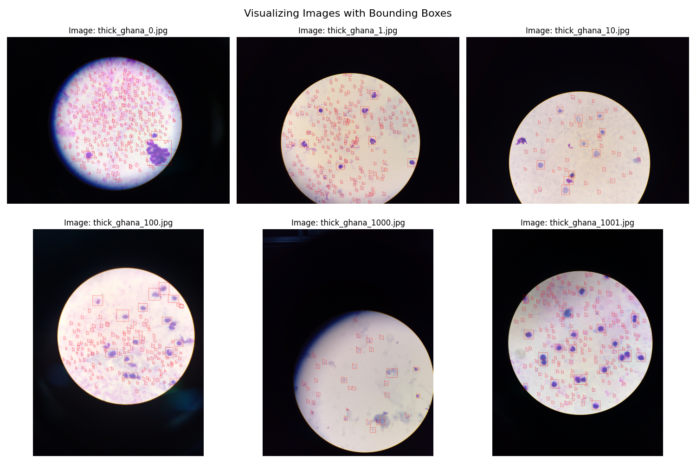

# Optimization of YOLO Architecture for Parasite Detection and Classification of Malaria in Microscopic Blood Smears




## Aims 

This repository aims to analyze and perform malaria classification on the Makerere AI Lab Lacuna Malaria Dataverse available here : https://dataverse.harvard.edu/dataset.xhtml?persistentId=doi:10.7910/DVN/VEADSE

This repository will explore the dataset, perform some analysis and build a model that can classify malaria in blood smears. The YOLO (You only look once) model will be used to assist with the 
detection and classification of the malaria in the blood smears.

## Getting started

To get started with this project, clone the repository and download the dataset from the link above.

Please move each .rar from the dataset into a folder named datasets in the root directory of the project. 

To install the dependencies for this project, you can run the following if you are using pip : 

- pip install -r requirements.txt

You will need to add a conf.json to the root of the project that defines the path to the yolo dataset for yolo to register it. The json looks as follows : 


```json
{
    "train": "{path_to_repo}/dataset/images/train",
    "val": "{path_to_repo}/dataset/images/val",
    "test": "{path_to_repo}/dataset/images/test"
}
```
