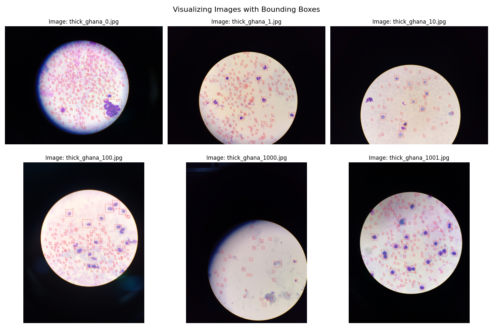

# Optimization of YOLO Architecture for Parasite Detection and Classification of Malaria in Microscopic Blood Smears




## Aims 

This repository aims to analyze and perform malaria classification on the Makerere AI Lab Lacuna Malaria Dataverse available here : https://dataverse.harvard.edu/dataset.xhtml?persistentId=doi:10.7910/DVN/VEADSE

This repository will explore the dataset, perform some analysis and build a model that can classify malaria in blood smears. The YOLO (You only look once) model will be used to assist with the 
detection and classification of the malaria in the blood smears.

## Specifications

This project was built in python 3.8.5 and uses a wide array of libraries such as : 

- numpy
- pandas
- matplotlib
- ultralytics

A full list of the dependencies can be found in the requirements.txt file.

For added Transparency, the final model (best.pt) and the transferred model (transferred.pt) can be found in the models folder. 

## Technical Requirements

The model was trained on a L40S GPU with 48 GB of dedicated VRAM on an image size of 1024, batch size of 8 using the medium sized YOLOv11 (m) model. 

Running the model will require a very large amount of RAM ~ 16GB dedicated VRAM and should take about 2-3 hours to train for 30 epochs. 

The codebase was run and hosted on  https://lightning.ai and should only cost about $20 to train the model for 30 epochs.

## Repository Layout

```
├── main.py
├── README.md
├── requirements.txt
├── conf.json
├── .gitignore
├── meta
│   ├── class_distribution.csv
│   ├── conf.example.json
├── models
│   ├── best.pt
│   ├── transferred.pt
├── picture
│   ├── plot_initial_data.png
├── tools
│   ├── dataAnalyzer.py
│   ├── extractor.py
│   ├── precision.py
│   ├── relabel.py
│   ├── rename.py
│   ├── setup.py
│   ├── split.py
├── transfer
│   ├── main.py
├── run-data
│   ├── before-transfer
│   ├── after-transfer
│   ├── testing-results
```

The repository is structured as follows :

- main.py : Main logic and code for the project -> run this to train and test the model
- requirements.txt : List of dependencies for the project
- conf.json : Configuration file required for generating data.yaml 
- meta : Folder containing metadata for the project
- models : Folder containing the trained models
- picture : Contains images for the README
- tools : Folder containing a bunch of tools for data analysis and dataset manipulation
- transfer : Folder containing the code the transferred model was trained on 
- run-data : Folder containing results used in report

## Getting started

To get started with this project, clone the repository and download the dataset from the link above.

Please move each .rar from the dataset into a folder named datasets in the root directory of the project. 

If you are using pip on linux, you first need to setup env and source from it. You can do this by running the following commands : 

```bash
    python3 -m venv env
    source env/bin/activate
```

To install the dependencies for this project, you can run the following if you are using pip : 

- pip install -r requirements.txt

You will need to add a conf.json to the root of the project that defines the path to the yolo dataset for yolo to register it. The json looks as follows : 


```json
{
    "train": "{absolute path_to_repo}/dataset/images/train",
    "val": "{absolute path_to_repo}/dataset/images/val",
    "test": "{absolute path_to_repo}/dataset/images/test"
}
```

Kindly note that the dataset, images and the train,val and test folders will all be generated once the main.py is run. 

You can then simply run the following command to extract the dataset, amend it and then train and test the model :

```bash
    python3 main.py
```

Please be patient when running the main.py for the first time, as it will extract all data from the datasets, merge and amend them together as well 
as perform some pre-processing on the data. 

You may ignore the warnings regarding corrupt JPEG's, this comes from the dataset, due to the images being taken with a specific device. It will not 
affect the training of the model.

## Results

YOLO will generate a runs folder within the root of the project that contains the results of the training and testing of the model.

More fine-grained and precise data analysis output can be found by making use of the scripts in the tools folder. 

